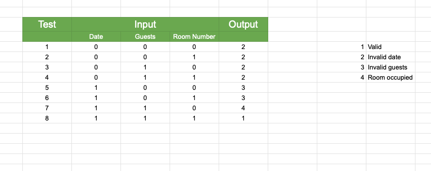

Proiectul de laborator va fi individual si va fi prezentat la laborator conform programarii stabilite cu cadrul didactic de la laborator.

Sa se scrie un program in Java, precum si cerintele (specificatia) acestuia.
(3p) Pe baza cerintelor programului, sa se genereze date de test folosind a) equivalence partitioning b) boundary value analysis si c) cause-effect graphing. Sa se implementeze testele obtinute folosind JUnit.  
(1p) Sa se stabileasca nivelul de acoperire realizat de fiecare dintre seturile de teste de la 1) a), b) si c) folosind unul dintre utilitarele de code coverage prezentate in [6]. Sa se compare si sa se comenteze rezultatele obtinute de cele trei seturi de teste.
(3p) Sa se transforme programul intr-un graf orientat si, pe baza acestuia, sa se gaseasca un set de teste care satisface criteriul modified condition/decision coverage (MC/DC).  
(1p) Sa se scrie un mutant de ordinul 1 echivalent al programului.  
(2p) Pentru unul dintre cazurile de testare de mai sus sa se scrie un mutant ne-echivalent care sa fie omorat de catre test si un mutant ne-echivalent care sa nu fie omorat de catre test.

Observatii:  
se poate folosi orice limbaj de programare care permite scrierea testelor unitare si folosirea unui tool de acoperire.
se poate testa o metoda (functie, procedura) din program, insa trebuie mentionat clar acest lucru, descrisa functionalitatea acesteia, iar toate cerintele se vor rezolva pe baza aceleiasi metode.  
pe langa programul efectiv si testele implementate, se va realiza si o documentatie in care se vor descrie detaliat cum s-au obtinut rezultatele pentru fiecare din cerintele proiectului.  
Graful asociat programului va fi realizat cu un utilitar (de exemplu: Lucidchart, Draw.io, yEd, Microsoft Visio). 

1. Generare date de test

a) Equivalence partitioning
- impartim domeniul de intrare in clase de echivalenta
- domeniul de intrare: check_in, check_out, guests, room_number
- conditii:
  - check_in < check_out
  - guests > 0
  - room_number (nu exista suprapuneri)
- clase de echivalenta:
  - [VALID] check_out > check_in
  - [INVALID] check_out <= check_in
  - [VALID] guests > 0
  - [INVALID] guests <= 0
  - [VALID] camera disponibila in intervalul check_in - check_out
  - [INVALID] camera indisponibila in intervalul check_in - check_out
- date de test:
  - {"check_in": "2024-01-01", "check_out": "2024-01-02", "guests": 2, "room_number": 1} -> VALID
  - {"check_in": "2024-01-06", "check_out": "2024-01-01", "guests": 2, "room_number": 2} -> INVALID (check_out <= check_in)
  - {"check_in": "2024-01-01", "check_out": "2024-01-02", "guests": -1, "room_number": 3} -> INVALID (guests <= 0)
  - {"check_in": "2024-01-01", "check_out": "2024-01-07", "guests": 2, "room_number": 1} -> INVALID (camera indisponibila)

b) Boundary value analysis
- selectam valorile limita din clasele de echivalenta
- limite:
  - limita minima valida: check_out == check_in + 1
  - limita invalida: check_out == check_in
  - limita minima valida: guests == 1
  - limita invalida: guests == 0
- date de test:
  - {"check_in": "2024-01-01", "check_out": "2024-01-05", "guests": 1, "room_number": 1} -> VALID
  - {"check_in": "2024-01-01", "check_out": "2024-01-01", "guests": 6, "room_number": 2} -> VALID
  - {"check_in": "2024-01-01", "check_out": "2024-01-01", "guests": 1, "room_number": 1} -> INVALID (check_out == check_in)
  - {"check_in": "2024-01-01", "check_out": "2024-01-02", "guests": 0, "room_number": 1} -> INVALID (guests == 0)

c) Cause-effect graphing
- identificam conditiile care influenteaza iesirea
- conditii:
  - C1: check_in < check_out
  - C2: guests > 0
  - C3: room_number (nu exista suprapuneri)
- efecte:
  - E1: rezervare facuta cu succes
  - E2: rezervare esuata (check_out <= check_in)
  - E3: rezervare esuata (guests <= 0)
  - E4: camera indisponibila
- reguli:
  - R1: C1 and C2 and C3 => E1
  - R2: not C1 => E2
  - R3: not C2 => E3
  - R4: not C3 => E4
  - R5: C1 and not C2 => E3
  - R6: C1 and not C3 => E4
  - R7: not C1 and C2 => E2
  - R15: C1 and not C2 and not C3 => E3
  - R17: C1 and C2 and not C3 => E1
- date de test:
  - {"name": "Sebi", "check_in": "2024-01-01", "check_out": "2024-01-02", "guests": 2, "room_number": 1} -> E1
  - {"name": "Sebi", "check_in": "2024-01-06", "check_out": "2024-01-01", "guests": 2, "room_number": 2} -> E2
  - {"name": "Sebi", "check_in": "2024-01-01", "check_out": "2024-01-02", "guests": -1, "room_number": 3} -> E3
  - {"name": "Sebi", "check_in": "2024-01-01", "check_out": "2024-01-07", "guests": 2, "room_number": 1} -> E4
  - {"name": "Sebi", "check_in": "2024-01-06", "check_out": "2024-01-01", "guests": -1, "room_number": 2} -> E2
  - {"name": "Sebi", "check_in": "2024-01-06", "check_out": "2024-01-01", "guests": 2, "room_number": 1} -> E2
  - {"name": "Sebi", "check_in": "2024-01-01", "check_out": "2024-01-01", "guests": 2, "room_number": 1} -> E2
  - {"name": "Sebi", "check_in": "2024-01-01", "check_out": "2024-01-01", "guests": 2, "room_number": 1} -> E2
  - {"name": "Sebi", "check_in": "2024-01-01", "check_out": "2024-01-01", "guests": 2, "room_number": 1} -> E2
  - {"name": "Sebi", "check_in": "2024-01-01", "check_out": "2024-01-01", "guests": 2, "room_number": 1} -> E2
  - {"name": "Sebi", "check_in": "2024-01-01", "check_out": "2024-01-01", "guests": 0, "room_number": 1} -> E3 

2. Coverage
- coverage run --source=app -m pytest --verbose test

- interpretarea rezultatelor:
  - Equivalence Partitioning:
    - a acoperit 100% din liniile de cod testate
    - performanta buna pentru testarea caurilor generale a unei metode simple
    - poate rata limite speciale
  - Boundary Value Analysis:
    - acoperire mai mica deoarece se concentreaza exclusiv pe valorile limita
    - performanta buna pentru testarea valorilor limita
  - Cause-Effect Graphing:
    - a acoperit 100% din liniile de cod testate
    - include combinatii logice, ceea ce duce la o testare mai corecta
    - necesita timp mai mare pentru analiza si implementare

3. Graf orientat si MC/DC

- date de test:
    - {"name": "Sebi", "check_in": "2024-01-01", "check_out": "2024-01-05", "guests": 2, "room_number": 1} -> O1
    - {"name": "Sebi", "check_in": "2024-01-02", "check_out": "2024-01-01", "guests": 0, "room_number": 1} -> O2
    - {"name": "Sebi", "check_in": "2024-01-02", "check_out": "2024-01-01", "guests": 0, "room_number": 2} -> O2
    - {"name": "Sebi", "check_in": "2024-01-02", "check_out": "2024-01-01", "guests": 2, "room_number": 1} -> O2
    - {"name": "Sebi", "check_in": "2024-01-02", "check_out": "2024-01-01", "guests": 2, "room_number": 2} -> O2
    - {"name": "Sebi", "check_in": "2024-01-01", "check_out": "2024-01-04", "guests": 0, "room_number": 1} -> O3
    - {"name": "Sebi", "check_in": "2024-01-01", "check_out": "2024-01-04", "guests": 0, "room_number": 2} -> O3
    - {"name": "Sebi", "check_in": "2024-01-01", "check_out": "2024-01-04", "guests": 2, "room_number": 1} -> O4

4. Mutant echivalent de ordinul I
- am facut o mica modificare la modul in care se verifica daca camera este disponibila
- aceasta modificare nu modifica logica programului, deci mutantul este echivalent
- mutantul nu este omorat de niciun test

5. Mutant ne-echivalent
- am modificat sistemul de rezervari, astfel incat rezervarea minima sa fie de 2 nopti pentru un singur oaspete
- mutantul nu este echivalent si este omarat de teste
- am modificat sistemul de rezervari, astfel incat in momentul in care se incearca rezervarea unei camere indisponibile, sa se afiseze intervalele disponibile pentru acea camera
- aceasta modificare nu schimba logica conditiilor programului, deci mutantul nu este omorat de niciun test